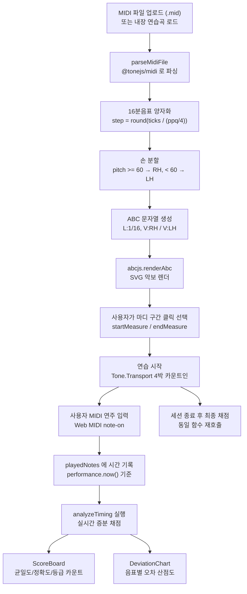

# 프로젝트 명세서 (Piano Tech Coach)

| 항목 | 내용 |
| --- | --- |
| 프로젝트명 | Piano Tech Coach (Even-Time Rhythmic Technic Analyzer) |
| 저장소 경로 | `/home/x/Workspace/piano-tech-coach` |
| 성격 | 디지털 피아노의 MIDI 입력을 브라우저에서 실시간 채점하는 클라이언트 전용 SPA |
| 원격 / 기준선 | `git@github.com:tohichoi/piano-tech-coach.git`, `origin/main...HEAD` = `0 0` (2026-09-23 확인) |
| 디렉터 개발 이력 | 2 커밋, 모두 2026-06-23 (`d7cc130` Initial commit, `68fe009` README 갱신) |
| ATD 편입일 | 2026-09-23 |
| ATD 역할 | 분석, 문서화, 플랫폼 이관 검증, 그리고 거버넌스 승인 후 소스 수정 1건 (§4.1). 감사(Elena)·검증(Noah) 수행 완료, 판정은 NEEDS_IMPROVEMENT (§4.5) |
| 코드 규모 | `src/` TypeScript/TSX 2,718행 + CSS 1,444행 = 4,162행 |
| 기술 스택 | React 19 + TypeScript + Vite (프론트엔드 단독), Tone.js(오디오), @tonejs/midi(MIDI 파싱), abcjs(악보 렌더링), lucide-react(아이콘), Vanilla CSS |
| 패키지 관리 | `npm` (`package.json`, `package-lock.json`) |

## 1. Goal & Vision (목표 및 비전)

- 개요: 피아노 연습에서 "박자를 정확히 맞추는 것"과 "음 사이 간격을 고르게 유지하는 것"은 서로 다른 능력이지만, 사용자는 자기 연주가 어느 쪽에서 무너지는지 스스로 판별하기 어렵다. 본 프로젝트는 디지털 피아노의 MIDI 출력을 브라우저가 직접 받아, 기준 그리드 대비 오차와 인접 음 간격의 균일도를 분리 채점하여 실시간으로 보여준다.
- 핵심 해결 과제:
  - MIDI 파일 하나로 연습 구간을 지정하고, 그 구간만 메트로놈과 함께 반복 연주할 수 있게 한다.
  - 연주 중 들어오는 MIDI 노트를 예상 음표와 대조해 실시간으로 오차를 계산한다.
  - 기준 그리드 정확도(절대 오차)와 균일도(간격 비율 편차)를 분리해, 어느 축이 약한지 즉시 식별 가능하게 한다.
  - 서버 없이 브라우저 안에서 모든 파싱·연산·재생을 완결하여, 악보(MIDI)와 연주 데이터가 외부로 나가지 않게 한다.
- 가치: 악보 이미지나 녹음 파일을 올릴 필요 없이 MIDI 파일 하나와 디지털 피아노만 있으면 즉시 채점 환경이 갖춰진다. 외부 VST 라우팅을 지원하므로 채점은 웹에서, 소리는 데스크톱 가상악기에서 낼 수 있다.
- 공식 가이드 및 문서 목록:
  - [README.md](README.md) (기능·기술 스택·설치 안내, 영문)
  - [AGENTS.md](AGENTS.md) (ATD 공통 SSOT 심볼릭 링크, `/home/x/.agents-hub/core/AGENTS.md` 대상)
  - [CLAUDE.md](CLAUDE.md) (ATD Claude 어댑터 심볼릭 링크)
  - [docs/PROJECT-PROMOTION.md](docs/PROJECT-PROMOTION.md) (편입 기술 케이스 스터디)
  - [docs/PROMOTION-SPEC.toml](docs/PROMOTION-SPEC.toml) (포트폴리오 연동 규격)
  - [PROJECT-DESCRIPTION.md](PROJECT-DESCRIPTION.md) (본 문서)

## 2. Domain & System Mission (도메인 및 시스템 핵심 미션)

- 도메인: 피아노 테크닉 훈련, 그중에서도 "even-time"(음 사이 간격을 고르게 유지하는 주법) 도메인. 절대 박자 정확도와 상대 간격 균일도를 분리해 측정하는 것이 본 시스템의 미션이다.
- 도메인 특화 규칙:
  - 타이밍 등급 경계는 3단계 고정 상수다. 절대 오차 35ms 이하 perfect, 80ms 이하 good, 180ms 이하 poor, 그 초과 또는 미연주는 missed로 판정한다 (`src/utils/timeAnalyzer.ts:32-34`, `:113-122`). 180ms는 매칭 탐색 창으로도 재사용되어, 같은 음높이의 연주 노트라도 180ms를 넘게 벌어져 있으면 매칭 자체가 성립하지 않는다 (`src/utils/timeAnalyzer.ts:99`).
  - 매칭은 탐욕적(greedy)이다. 예상 음표를 시간순으로 돌면서 같은 음높이의 아직 소비되지 않은 연주 노트 중 가장 가까운 하나를 고른다. 화음은 음높이별로 독립 매칭되며, 이미 매칭된 연주 노트는 재사용되지 않는다 (`src/utils/timeAnalyzer.ts:84-107`).
  - 절대 그리드 정확도(accuracy)는 오차에 대해 조각별 선형(piecewise-linear) 점수를 준다. 35ms 이하 100점, 180ms 이상 20점, 그 사이는 35~180ms 구간에서 100→20으로 선형 감쇠하며 하한은 20점이다. 미연주는 0점이다 (`src/utils/timeAnalyzer.ts:155-166`).
  - 균일도(evenness)는 인접 연주 음의 간격 비율(실제 간격 / 예상 간격)의 표준편차 σ로 계산한다. 두 예상 음이 같은 틱에 시작하는 경우(화음)는 분모가 0이 되므로 `expectedDelta > 0.001` 조건으로 제외한다 (`src/utils/timeAnalyzer.ts:185`). 점수식은 `max(0, 100 × (1 - 4σ))`이며, σ = 0.25(평균 25% 간격 오차)에서 0점이 된다 (`src/utils/timeAnalyzer.ts:202`). 예상 음표가 1개이고 그것을 연주한 경우만 균일도를 100으로 본다 (`src/utils/timeAnalyzer.ts:206-208`).
  - 최종 점수 가중치는 균일도 60% : 그리드 정확도 40%다. 이 프로젝트의 목표가 "고르게 치기"이므로 균일도에 더 큰 비중을 둔다 (`src/utils/timeAnalyzer.ts:213-215`).
  - MIDI 음표는 16분음표 그리드로 양자화한다. 1스텝 길이는 `round(ppq / 4)` 틱이며, 음표 시작 틱을 이 값으로 나눠 반올림해 스텝 인덱스를 얻는다 (`src/utils/midiParser.ts:63`, `:84`). 마디당 스텝 수는 박자표에서 파생한다(`stepsPerMeasure = 박자표분자 × (16 / 박자표분모)`, 4/4에서는 16) (`src/utils/midiParser.ts:86`).
  - 손 분할은 음높이 60(C4) 기준으로 고정한다. 60 이상은 오른손(treble clef), 60 미만은 왼손(bass clef)으로 나눠 서로 다른 ABC 보이스로 렌더링한다 (`src/utils/midiParser.ts:106-107`).
  - ABC 악보는 단위 음표 길이 `L:1/16`, 조표 `K:C` 고정으로 생성하고, 두 보이스(`V:RH clef=treble`, `V:LH clef=bass`)를 병기한다 (`src/utils/midiParser.ts:186-196`).
  - 메트로놈과 가이드 재생은 Tone.js Transport 스케줄러로 구동한다. 1마디(4박) 카운트인 뒤 테스트가 시작되며, 시작 시각을 `performance.now()`로 고정해 실시간 채점의 시간 원점으로 쓴다 (`src/App.tsx:166` 카운트인 시작, `:186` 시간 원점 고정).
  - 가상 건반은 C3~C6(MIDI 48~84) 고정 범위다 (`src/App.tsx:449`, `:467`).
  - 휴먼 타이밍 시뮬레이터는 정확도 슬라이더(0~100%)를 받아 Box-Muller 변환으로 가우시안 타이밍 오차를 주입한다. 정확도 95% 이상은 오차 0(기계적 정확 연주)으로 취급하고, 그 미만은 σ를 0.002초에서 0.25초로 스케일한다. 미연주 확률은 0% 정확도에서 최대 20%다 (`src/App.tsx:326-332`, `:340-344`).
- 시스템 주요 요구사항 및 제약조건:

| 구분 | 내용 | 근거 |
| --- | --- | --- |
| 런타임 | Node.js 20.19.0 이상 또는 22.12.0 이상 (Vite 8 / rolldown engines 요구사항, Node 18 불가), 모던 브라우저 (Web MIDI API + Web Audio) | `README.md:68`, `src/components/MidiConnector.tsx:29-30` |
| 서버 | 없음. 클라이언트 전용 SPA이며 백엔드·DB·API 엔드포인트가 존재하지 않는다 | 저장소 전체에 서버 코드 0건, `src/` 단일 트리 |
| 하드웨어 | Web MIDI 지원 브라우저와 MIDI 입력 장치(디지털 피아노). 미지원 환경은 `MidiConnector`가 `unsupported` 상태를 표시한다 | `src/components/MidiConnector.tsx:29-33` |
| 오디오 | Tone.js AudioContext를 사용자 제스처 이후 시작한다 (`startAudio` 후 재생) | `src/App.tsx:140`, `src/utils/audioSynth.ts` |
| 입력 포맷 | 표준 MIDI 파일(`.mid` / `.midi`) | `src/App.tsx:583` |
| 외부 VST | 브라우저가 VST 바이너리를 직접 로드할 수 없으므로 loopMIDI 등 가상 MIDI 포트를 거쳐 DAW로 라우팅한다 | `README.md:91-135` |
| 채점 모드 | 실시간 증분 채점과 세션 종료 후 최종 채점 두 경로가 같은 `analyzeTiming` 함수를 공유한다 | `src/App.tsx:87-95`, `:237-244` |
| 빌드 | `tsc -b && vite build`, ESLint 10 (typescript-eslint) 적용 | `package.json:8`, `eslint.config.js` |

## 3. Workflows & Architecture (핵심 워크플로우 및 체계)

### 3.1 아키텍처 개요: 백엔드 없는 클라이언트 전용 SPA

본 저장소에는 백엔드가 없다. HTTP API, 데이터베이스, 서버 프로세스, 별도 워커가 모두 존재하지 않으며, `src/` 하위의 TypeScript/TSX 파일 전체가 브라우저에서 실행된다. 따라서 ATD 표준 템플릿이 전제하는 "설계-백엔드-프론트엔드-감사-QA" 5-Agent 파이프라인 중 백엔드 단계는 이 프로젝트에 대응하는 계층 자체가 없다. 이 프로젝트의 3계층은 브라우저 안에서 다음과 같이 나뉜다.

| 계층 | 위치 | 책임 |
| --- | --- | --- |
| 표현 계층 | `src/components/*.tsx`, `src/App.tsx` | 화면 렌더링, 사용자 입력, 상태 보관 |
| 도메인 로직 계층 | `src/utils/midiParser.ts`, `src/utils/timeAnalyzer.ts`, `src/utils/exerciseGenerator.ts` | MIDI 파싱·양자화, 채점 연산, 연습곡 생성 |
| 오디오/장치 계층 | `src/utils/audioSynth.ts`, `src/components/MidiConnector.tsx` | 신디사이저 재생, Web MIDI 입출력 |

상태는 외부 상태관리 라이브러리 없이 `App.tsx`의 `useState` / `useRef` / `useCallback`만으로 관리한다. 단방향 흐름은 `App.tsx`가 모든 상태를 소유하고, 컴포넌트는 props로 값과 setter를 받는 구조로 유지된다 (`src/App.tsx:33-59`).

### 3.2 핵심 워크플로우

- 두 채점 경로(실시간 / 최종)는 동일한 `analyzeTiming`을 호출한다. 실시간 경로는 `elapsedTime`을 넘겨 아직 도래하지 않은 음표를 건너뛰고, 최종 경로는 이를 생략해 전체 구간을 확정 채점한다 (`src/utils/timeAnalyzer.ts:86-88`, `:136-138`).
- 실시간 채점은 매 박마다 실행되어 진행 중에도 점수가 갱신되며, 레퍼런스(`isPlayingRef` 등)로 클로저 stale 문제를 회피한다 (`src/App.tsx:62-76`, `:84-98`).

### 3.3 핵심 컴포넌트 계층

| 계층 | 파일 | 행 수 | 책임 |
| --- | --- | --- | --- |
| 진입점 | `src/main.tsx` | 10 | React 루트 마운트 |
| 컨테이너 | `src/App.tsx` | 636 | 전역 상태 소유, MIDI 이벤트 수신, 채점 실행, 레이아웃 조립, 가상 건반 렌더 |
| 표현 | `src/components/SheetMusicViewer.tsx` | 299 | abcjs SVG 악보 렌더, 마디 클릭 선택 |
| 표현 | `src/components/MidiConnector.tsx` | 225 | Web MIDI 입출력 장치 스캔·선택, 상태 표시 |
| 표현 | `src/components/DeviationChart.tsx` | 199 | 음표별 타이밍 오차 산점도(SVG) |
| 표현 | `src/components/ScoreBoard.tsx` | 186 | 총점·균일도·정확도·등급별 카운트 표시 |
| 표현 | `src/components/Metronome.tsx` | 118 | BPM 설정, 재생/정지, 카운트인, 가이드 토글 |
| 표현 | `src/components/InstrumentSelector.tsx` | 104 | 내장 가상악기 4종 + 외부 MIDI Out 선택 |
| 표현 | `src/components/SimulatorPanel.tsx` | 86 | 정확도 슬라이더 기반 시뮬레이션 실행·오디션 |
| 유틸 | `src/utils/timeAnalyzer.ts` | 227 | 오차 매칭, 정확도·균일도 산출, 최종 점수 |
| 유틸 | `src/utils/audioSynth.ts` | 255 | Tone.js 신디사이저 4종, MIDI Out 라우팅, 메트로놈 틱 |
| 유틸 | `src/utils/midiParser.ts` | 206 | MIDI 파싱, 양자화, 손 분할, ABC 생성 |
| 유틸 | `src/utils/exerciseGenerator.ts` | 128 | 내장 연습곡(C 메이저 스케일, 하논 1번) 생성 |
| 타입 | `src/types/abcjs.d.ts` | 39 | abcjs 타입 보강 |
| 스타일 | `src/App.css` | 1,350 | 컴포넌트 스타일 (Vanilla CSS) |
| 스타일 | `src/index.css` | 94 | 전역 스타일 |

- 내장 연습곡은 별도 MIDI 파일이 아니라 `@tonejs/midi`로 MIDI 객체를 코드에서 생성한 뒤, 파일 업로드와 같은 파서(`parseMidiFile`)를 통과시켜 동일한 데이터 경로를 재사용한다 (`src/utils/exerciseGenerator.ts:8`, `:123-127`).
- 내장 가상악기는 어쿠스틱 피아노·로즈 피아노·재즈 오르간·신스 리드 4종이며, 이에 더해 외부 MIDI Out 모드가 있다 (`src/utils/audioSynth.ts:3`, `README.md:23-27`).

### 3.4 데이터 흐름의 단일화 지점

- MIDI 파일 업로드(`src/App.tsx:251-279`)와 내장 연습곡 로드(`src/App.tsx:282-300`)는 둘 다 `ParseResult`(`abcString` / `expectedNotes` / `bpm` / `timeSignature` / `totalMeasures` / `title`)를 만들어 같은 상태에 넣는다 (`src/utils/midiParser.ts:13-20`). 이후 파이프라인은 입력 출처를 구분하지 않는다.
- 채점 입력은 `ExpectedNote[]`(예상)와 `PlayedNote[]`(실제) 두 배열뿐이다. 실시간 MIDI 입력도, 시뮬레이터가 만든 합성 데이터도 같은 `PlayedNote` 형태로 정규화되어 하나의 채점 함수로 들어간다 (`src/utils/timeAnalyzer.ts:3-8`, `src/App.tsx:114-118`, `:350-355`).

### 3.5 에이전트 파이프라인 연계 구조

본 프로젝트는 디렉터 단독 개발 산출물이며, ATD는 기능 구현에 참여하지 않았다. 따라서 편입 시점에 백엔드 구현 단계는 편성 대상이 아니다. 편입 이후 실제 수행한 작업은 §4.1에 기록한다.

| 구분 | 해당 여부 | 비고 |
| --- | --- | --- |
| 설계 단계 | 해당 없음 (편입 시점 기준) | 편입 시점에는 신규 설계가 없었고, 기존 구조 분석만 수행 |
| 백엔드 단계 | 해당 없음 | 이 저장소에 백엔드 계층 자체가 존재하지 않는다 |
| 프론트엔드 단계 | 부분 수행 | 승인 범위의 소스 수정을 Maya(문구 OS 중립화, 감사 지적 B4·N5)·Kai(시간축 격리)가 수행 (§4.1) |
| 감사 단계 | 수행 완료 | 서술-구현 불일치, 코드 품질 물리 제약 위반, 시크릿/PII 감사 — 판정 NEEDS_IMPROVEMENT (§4.5) |
| 검증 단계 | 수행 완료 | 빌드 무결성, 산출물 전수 대조, 소스 변경 2건 재검증 PASS (§4.5) |

- 프론트엔드 단계는 편입 후 승인된 소스 수정으로만 수행됐고, 신규 기능 구현은 포함하지 않는다. 감사(Elena)와 검증(Noah)은 같은 날 수행을 마쳤으며 결과는 §4.5에 있다.

## 4. Architecture Roadmap (아키텍처 로드맵)

### 4.1 완료된 마일스톤

| 시기 | 내용 | 근거 |
| --- | --- | --- |
| 2026-06-23 | 프로젝트 초기 구성 및 전체 기능 구현 (React 19 + TypeScript + Vite) | 최초 커밋 `d7cc130` |
| 2026-06-23 | README에 프로젝트 개요·기능·기술 스택·설치 안내 정리 | 커밋 `68fe009` |
| 2026-09-23 | ATD 허브 편입: 기준선 동결 확인(`origin/main...HEAD` = `0 0`), 코드베이스 전수 분석, 본 명세서 작성 (Atlas) | 본 문서 |
| 2026-09-23 | 플랫폼 이관 검증 (Axel): `npm ci` 설치·빌드·lint 무결성, 외장 VST 라우팅 문서의 플랫폼 모순(Windows 전용 표기) 확인, 오디오 스택 실동작 확인 | `package.json:8`, `README.md:91-135` |
| 2026-09-23 | 편입 산출물 작성: `docs/PROMOTION-SPEC.toml`, `docs/PROJECT-PROMOTION.md` (Atlas), `docs/assets/` 에셋 4건 (Sora) | 본 문서 §5-1 |
| 2026-09-23 | 소스 수정 1건 (승인 후): 인앱 외장 VST 문구 OS 중립화 (Maya), Web MIDI/오디오 시간축 격리 헬퍼 신설 (Kai) | `src/components/InstrumentSelector.tsx`, `src/components/MidiConnector.tsx`, `src/utils/audioSynth.ts` |
| 2026-09-23 | 감사 수행 (Elena): 편입 슬라이스 무관용 감사, 판정 **NEEDS_IMPROVEMENT**. N1 재현 검증(가우시안 지터 실측), 서술-구현 불일치 전수 조사, A11y 정적 전수조사, PII/제3자 저작물 전수 검사 | §4.5 |
| 2026-09-23 | 검증 수행 (Noah): 산출물 전수 대조(`docs/assets/` 4건 실재·JPEG·해상도·파일명 선례 일치), TOML 파싱, 하드 게이트 통과, 4,162행 재측정, 소스 변경 등가성 판정, 빌드/lint/audit 재현, 최소 검증집합 설계 | §4.5 |
| 2026-09-23 | 감사 판정 후속 정정 (Atlas): 문서 결함 정정 — 자기모순, Node 요건·인용 오류, Chloe 미수행 기재 삭제(§5-1 위반), N1 서술 정정, README UI 라벨, 낡은 인용 | 본 문서, `docs/PROMOTION-SPEC.toml`, `docs/PROJECT-PROMOTION.md`, `README.md` |

- 저장소 커밋 이력은 2건이며 모두 2026-06-23이다. 그 이전의 개발 과정(설계·반복 수정)은 커밋 이력으로 남아 있지 않으므로, 개발 소요 기간을 이력만으로 산정하지 않는다.
- 기준선은 2026-09-23 시점에 `git rev-list --left-right --count origin/main...HEAD` = `0 0`으로 확인했다. 소스 수정 1건과 편입 산출물은 이 기준선 위의 미커밋 변경이며, 커밋은 거버넌스가 수행한다. 기준선 자체가 바뀌면 본 문서와 편입 산출물은 폐기하고 다시 작성한다.
- **커밋 제약**: `PROMOTION-SPEC.toml`의 `development_origin = "mike+atd"`는 "편입 이후 ATD가 소스코드를 수정했다"를 뜻하고, `core/AGENTS.md` §5-1의 판단 기준은 참여 서술이 아니라 **커밋한 소스 변경**의 유무다. 따라서 소스 변경(7개 파일: `InstrumentSelector.tsx`, `MidiConnector.tsx`, `audioSynth.ts`, `DeviationChart.tsx`, `Metronome.tsx`, `SheetMusicViewer.tsx`, `SimulatorPanel.tsx`)과 편입 산출물(본 문서, `docs/PROMOTION-SPEC.toml`, `docs/PROJECT-PROMOTION.md`, `docs/assets/`)은 **반드시 같은 커밋에 포함**해야 한다. 문서만 커밋되고 소스 변경이 빠지면 `mike+atd`의 근거가 사라져 `"mike"`로 정정해야 한다. 커밋은 거버넌스가 수행하며, **커밋 메시지 언어는 영어로 확정**됐다(저장소 기존 이력 `d7cc130`, `68fe009`가 영어).
- 이번 라운드에 수행한 소스 수정은 아래 성격으로 한정되며, 신규 기능 구현은 포함하지 않는다.
  - 문구 OS 중립화: `InstrumentSelector.tsx`, `MidiConnector.tsx`에서 "Windows VST", "loopMIDI" 전용 표현을 OS 중립 표현으로 정정 (순 0행).
  - 시간축 격리: `audioSynth.ts`에 `performanceTimeFromNow` 헬퍼를 신설해 Web MIDI `send()`의 `performance.now()` 시간축과 Tone/AudioContext 시간축을 분리 (순 +9행). 메트로놈 정지→재시작 시의 Transport 틱 역행 에러는 해소하지 못했다 (§4.4 N3).

### 4.2 아직 수행하지 않은 후속 작업

소스 수정은 2026-09-23에 거버넌스 승인을 받아 수행됐고(§4.1), 감사(Elena)와 검증(Noah)도 같은 날 수행을 마쳤다(§4.5). 남은 후속 작업은 다음과 같다.

| 순서 | 항목 | 비고 |
| --- | --- | --- |
| 1 | 소스 결함 상환 | 감사·검증이 적발한 소스 결함 중 2건(B4·N5)은 승인 하에 수정·재검증 완료했다. 나머지는 §4.4 백로그로 이관했다 (승인 범위 밖) |
| 2 | 허브 포트폴리오 등재 | 허브 `docs/projects/piano-tech-coach.toml` 등록 및 기여 (허브 소유, 미등록) |
| 3 | 소스 변경과 편입 산출물의 동일 커밋 반영 | 커밋은 거버넌스가 수행 (§4.1 커밋 제약) |
| 4 | 코드 품질 물리 제약 대응 | `src/App.css` 1,350행·`src/App.tsx` 636행이 300줄 상한을 초과한다 (§4.3, B7) |

### 4.3 알려진 구조적 특성

- 자동 테스트가 0건이다. 테스트 프레임워크(vitest·jest 등)와 테스트 파일(`*.test.*`, `*.spec.*`)이 모두 존재하지 않는다. 회귀를 감지할 자동 장치가 없으므로, 향후 소스 수정 시 최소 검증 집합을 먼저 수립해야 한다.
- CSS를 포함한 실제 코드 규모는 4,162행이며, 이 중 `src/App.css`가 1,350행으로 단일 파일 최대치다. ATD 코드 품질 물리 제약(`core/code-quality.md` §2, 파일 300줄) 기준으로 보면 초과 파일이 존재한다.
- `App.tsx`는 636행으로 컨테이너 하나가 전역 상태·MIDI 이벤트 처리·채점 호출·가상 건반 렌더를 함께 담당한다. 표현 컴포넌트는 이미 7개로 분리되어 있으나, 상태와 오케스트레이션은 단일 파일에 집중되어 있다.

### 4.4 개선 백로그

편입 과정에서 도출한 항목을 해소 여부와 무관하게 전부 기록한다. 해소된 항목도 표에서 지우지 않고 `상태`로 구분해 남긴다. 감사·검증에서 적발되는 항목도 삭제하지 않고 이 표로 이관한다.

식별자 규약: `B*` 는 초기 편성안에서 도출한 항목, `N*` 는 이번 라운드에 새로 확인한 항목, `R*` 는 초기 편성안에 식별자 없이 2순위로만 언급됐던 항목을 코드 기준으로 재도출해 부여한 식별자다.

| ID | 상태 | 심각도 | 항목 | 근거 | 상환 시점 |
| --- | --- | --- | --- | --- | --- |
| B1 | 활성 | 중간 | 종료 스케줄의 조건이 `>=`라 매 틱마다 종료 콜백이 다시 예약된다. 조건을 `===`로 바꾸면 1회만 예약된다 | `src/App.tsx:213` | WS1과 함께 상환 |
| B2 | 해소 | — | Web MIDI 출력이 `performance.now()` 시간축으로 갈아타 Tone 시간축과 혼용되던 문제. Kai가 `performanceTimeFromNow` 헬퍼를 신설해 두 축을 분리했다 | 해소 전 `src/utils/audioSynth.ts:199-201` → 해소 후 `src/utils/audioSynth.ts:107`(헬퍼), `:207`·`:209`(적용) | 해소 (2026-09-23, Kai) |
| B3 | 활성 | 중간 | `analyzeTiming`이 타건마다 O(n·m) 전수 재계산을 하고 `matchedPlayedIndices`도 매번 재생성해 실시간 판정이 흔들린다. N1(균일도 붕괴)과는 다른 항목이다 | `src/App.tsx:119`, `src/utils/timeAnalyzer.ts:94-103` | 성능 개선 승인 시 |
| B4 | **검증 완료** | 중간 | 문서-구현 불일치(엘레나 감사 지적): 편차 차트 범례가 `±150ms`인데 실제 등급 컷은 180ms다. 150은 `DeviationChart.tsx:36`의 `maxDevMs`(Y축 표시 상한)이고 등급 컷은 `timeAnalyzer.ts:34`의 180이다. 범례의 Perfect/Good도 함께 점검한다. `±` 표기 자체는 유지한다(`timeAnalyzer.ts:113`이 `absDevMs <= WINDOW` 대칭 비교라 `±`가 정확). 악보 뷰어 범례의 `≤`/`±` 표기 문제는 N9로 추적(미수정) | `src/components/DeviationChart.tsx:193`(범례), `:36`(Y축 상한 150) vs `src/utils/timeAnalyzer.ts:34`(`POOR_WINDOW = 180`), `:113`, `README.md:36-37`(`≤ 180ms`) | **검증 완료 (2026-09-23, 거버넌스 승인 2건 중 1)** — 범례 150→180 정정 후 Noah 재검증 PASS: 범례 내 `150ms`/`±150` grep 0건, `maxDevMs=150`은 Y축 표시 클램프로 불변 유지 |
| B5 | 해소 | — | `PROJECT-DESCRIPTION.md`가 템플릿 placeholder 상태였던 문제. 실내용으로 작성 완료 | `PROJECT-DESCRIPTION.md` | 해소 (2026-09-23, Atlas) |
| B6 | 해소 | — | 심볼릭 링크·`.serena/` 추적 정책이 미결이었던 문제. 선례 조사로 정책을 확정하고 `.gitignore`에 반영 | `.gitignore` | 해소 (2026-09-23) |
| B7 | 활성 | 중간 (허브) | 허브 도구 갭: `check-code-quality.sh`의 파일 길이 검사가 `.py/.sh/.ps1/.bicep`만 대상으로 하고, 시크릿/PII 스캔도 `.ts/.tsx`를 빠뜨린다. `code-quality.md` §2는 언어 무관하게 300줄 상한을, §6은 "모든 파일"의 PII 금지를 규정하는데 검사 도구가 이를 못 잡는다. 실증: 이 저장소에 300줄 초과 2건(`src/App.css` 1,350 / `src/App.tsx` 636)이 있는데 스크립트는 PASS(exit 0)를 반환했다 | `/home/x/.agents-hub/scripts/check-code-quality.sh:19`(길이 검사), `:53`(PII 스캔); `/home/x/.agents-hub/core/code-quality.md` §2, §5, §6 | 허브 SSOT 개정 사안 — 스크립트 수정 금지, 거버넌스 결정 대기 |
| N1 | 활성 | 높음 | 균일도(evenness) 지표가 실제 연주 대역에서 0으로 붕괴한다. `evennessScore = max(0, 100×(1 − 4σ_r))`이고 σ_r은 인접 간격의 (실측÷기대) 비율의 표준편차다. 16분음표 @ 80 BPM(기대 간격 187.5ms) 기준으로 **두 지점을 구분해야 한다**: (a) 공식 인자가 0이 되는 해석적 교차점 σ_t = 0.25×187.5/√2 ≈ **33.15ms**, (b) 300회 평균 실측에서 evenness 평균이 0.5점 미만으로 떨어지는 지점 σ_t ≈ **39~41ms**(이분탐색 39.03ms, 실측 41ms에서 평균 0.15점). evenness는 뾰족한 임계가 아니라 **점근적으로 감소**한다 — σ_r이 약 63개 간격에서 추정되는 표본통계량이라 시행마다 흔들리기 때문이다(σ_t=30ms 평균 11.04 / 33ms 5.03 / 35ms 2.38 / 39ms 0.82 / 41ms 0.15). 실제 피아니스트 타건 지터 20~50ms 구간이 대부분 이 붕괴 구간에 들어가고, 총점 60%를 차지하는 evenness가 무력화되어 총점은 사실상 grid accuracy(40%)만으로 결정된다. **템포 민감도**(동일 20ms 지터, Elena 실측): 60 BPM evenness 54.3·총점 72.4 → 80 BPM 39.1·63.4 → 100 BPM 23.8·54.1 → 120 BPM 9.2·45.4 → 140 BPM 1.7·41.0 → 160 BPM 0.0·40.0. 같은 연주가 템포만 바뀌어도 총점이 72에서 40까지 벌어진다. 또한 시뮬레이터 프리셋 4개 중 3개("보통 80%"·"미흡 50%"·"엉망 20%")가 모두 σ 41ms 이상 구간에 포화되어 상호 구분이 불가능하고, 사실상 "우수(95%)=100점"과 "나머지 전부 40점 이하" 2단계로 붕괴한다. README의 "Evenness is prioritized" 선언과 실제 동작이 어긋난다 | `src/utils/timeAnalyzer.ts:202`, `README.md:39-41`, `src/components/ScoreBoard.tsx:65`, `src/components/SimulatorPanel.tsx:52` | 감사·검증 결과 반영 후, 채점 파라미터 재설계 승인 시 |
| N2 | 활성 | 중간 | 카운트인 오버레이가 메트로놈 카드에 갇힌다. `.countdown-overlay`가 `position: fixed; inset: 0`이지만 조상 `.glass-card`의 `backdrop-filter: blur(12px)`가 자손의 containing block을 생성하므로 뷰포트가 아닌 카드에 갇힌다. 의도(전체 화면 블러 + 대형 카운트다운)와 다르게 좌측 카드 안에만 렌더된다 | `src/App.css:114`(`.glass-card` `backdrop-filter`), `src/App.css:639-640`(`.countdown-overlay`), `src/components/Metronome.tsx:37` | UI 결함 해소 승인 시 |
| N3 | 활성 | 중간 | Transport 정지→재시작 시 메트로놈 틱 시각이 역행해 Tone `Timeline`의 `assert(GTE(event.time, lastValue.time))`가 throw한다. 역행폭이 정확히 3.90625ms = 80 BPM·PPQ 192의 1틱이다(`(60/80)/192×1000`). 원인은 `audioSynth.ts`가 아니라 `App.tsx`의 정지→재시작 처리다. 실질 영향은 낮다(점수·악보·분석 무관, 6회 재시작에 2~10회 틱 간헐 누락). Kai가 승인받아 수행한 시간축 격리 수정은 이 에러를 해소하지 못했다 | `src/App.tsx:151-152`(정지), `:225`·`:230-231`(재시작), `tone/build/esm/core/context/Timeline.js:46` | WS1(`App.tsx` stale closure)과 같은 구역이므로 함께 상환 |
| N4 | 활성 (미검증) | 중간 | `Tone.Draw.schedule` 콜백이 `Transport.cancel()`로 취소되지 않아, 이전 실행의 자동정지 콜백이 다음 실행을 정지시킬 수 있다. Kai가 발견했으나 미검증 상태다 | `src/App.tsx:203-208`, `:425-433` | WS1 인접 구역, 감사 결과와 함께 상환 |
| R1 | 활성 | 중간 | `analyzeTiming` 호출부가 `stepsPerMeasure`를 리터럴 16으로 고정한다. `midiParser`는 박자표에서 `stepsPerMeasure = 박자표분자 × (16 ÷ 박자표분모)`를 파생하므로(3/4이면 12), 4/4가 아닌 곡에서는 마디→스텝 환산이 어긋나 선택 구간 필터가 오채점된다 | `src/App.tsx:93`, `:243`, `:365`, `src/utils/timeAnalyzer.ts:42` vs `src/utils/midiParser.ts:86`, `:102` | 감사·검증 결과 반영 후 |
| N5 | **검증 완료** | 중간 | A11y: 폼 요소에 라벨-컨트롤 연결(`htmlFor`+`id`)이 없어 스크린리더가 입력의 목적을 읽지 못한다. 6건 | `src/components/MidiConnector.tsx:169`, `:189`, `src/components/Metronome.tsx:76-81`, `src/components/SheetMusicViewer.tsx:243-248`, `:257-262`, `src/components/SimulatorPanel.tsx:41-49` | **검증 완료 (2026-09-23, 거버넌스 승인 2건 중 2)** — 라벨-컨트롤 연결 후 Noah 재검증 PASS: 접근성 트리 접근명 6/6 획득(미획득 0건), 신규 id 6종 중복 0건(`duplicateIds: []`) |
| N6 | 활성 | 낮음 | 디자인 시스템 간격 토큰 부재(엘레나 #12): `App.css`가 4px/8px 리듬 토큰 없이 임의 px를 직접 사용한다. `index.css` `:root`에는 색상·폰트 토큰만 있고 간격 토큰이 없다 | `src/App.css`(예: `:6` `padding: 24px`, `:188` `padding: 8px 12px`, `:206` `border-radius: 4px`), `src/index.css:4-36`(`:root`에 간격 토큰 부재) | UI 정비 승인 시 |
| N7 | 활성 | 낮음 | A11y: 아이콘 전용 버튼과 파일명이 네이티브 `title` 속성에만 의존해 터치·키보드 사용자와 스크린리더에서 접근이 어렵다. 아이콘 버튼 `aria-label`도 없다 (엘레나 #11) | `src/components/MidiConnector.tsx:135`(`title="장치 새로고침"`), `src/components/Metronome.tsx:63`, `src/App.tsx:588` | A11y 개선 승인 시 |
| N8 | 활성 | 낮음 | 문구 결함(엘레나 #13): `음호출`이라는 조어가 남아 있고, DAW 예시 목록이 README와 인앱에서 서로 다르다 | `src/components/InstrumentSelector.tsx:98`(음호출) vs `:97`(Cubase, Ableton, Reaper) 및 `README.md:103`(Ableton Live, FL Studio, Reaper, Cubase) | 문구 정합 승인 시 |
| N9 | 활성 | 낮음 | 표기 부정확: 악보 뷰어 범례가 `≤35ms`인데 `timeAnalyzer.ts:113`은 `absDevMs <= WINDOW` 대칭 비교이므로 `±35ms`가 정확하다. B4의 승인 범위(편차 차트) 밖이라 미수정 | `src/components/SheetMusicViewer.tsx:284` vs `src/utils/timeAnalyzer.ts:113` | 문구 정합 승인 시 |
| N10 | 활성 | 낮음 | `PROMOTION-SPEC.toml`의 "선례" 주장 검증 가능성(엘레나 #9): 허브 `docs/projects/*.toml`은 git 원격 등록부일 뿐 `development_origin`/`case_study_badge` 필드를 갖지 않아 선례를 허브에서 국소 검증할 수 없다. 본 문서에서 선례 저장소·파일을 명시해 근거를 좁혔다 | `docs/PROMOTION-SPEC.toml` 헤더, 각 선례 저장소의 `docs/PROMOTION-SPEC.toml` | 문서 표현 정리 시 |

- 심각도는 편입 시점의 정적 판단이며, 감사(Elena)의 PASS/FAIL 판정 대상이 아니다.
- **엘레나가 판정 불가로 남긴 항목**: N3·N4의 런타임 재현은 미수행(정적 근거만 확보), N10의 선례 실제 spec은 각 프로젝트 저장소 소관이라 허브에서 국소 검증이 불가능하다. 두 항목은 위 표에 그대로 남겨 다음 검증 라운드로 넘긴다.

### 4.5 감사·검증 결과 (2026-09-23)

감사(Elena)와 검증(Noah)을 같은 날 수행했다. **감사 판정은 NEEDS_IMPROVEMENT이며, 이 문서의 정정 작업은 그 판정의 후속이다.** 감사가 지적한 소스 결함 2건(§4.4 B4·N5)은 승인 하에 수정되고 Noah 재검증 PASS로 확인됐다(개별 항목 한정). 다만 감사 verdict는 이번 슬라이스 전체에 대한 것이고 N1 등 나머지 결함이 여전히 활성이므로 **NEEDS_IMPROVEMENT는 유지한다** — 이는 감사 verdict를 PASS로 바꾸는 것이 아니다.

**감사 (Elena, Chief Quality & Security Auditor) — 판정 NEEDS_IMPROVEMENT**

- N1 재현 검증: 가우시안 지터를 실측해 evenness 붕괴를 재현하고, 밀도·템포 민감도 곡선을 산출했다 (§4.4 N1).
- 서술-구현 불일치 전수 조사: 편차 차트 범례 `±150ms` vs 실제 컷 180ms (B4), 악보 뷰어 범례 `≤35ms` 표기 (N9) 등.
- A11y 정적 전수조사: 폼 요소 라벨 미연결 6건 (N5), 아이콘 버튼 `aria-label` 부재·네이티브 `title` 의존 (N7).
- 디자인 시스템·문구 조사: `App.css` 4px/8px 간격 토큰 부재 (N6), `음호출` 조어 및 DAW 예시 목록 불일치 (N8).
- 시크릿/PII·제3자 저작물 전수 검사 수행.
- 판정 불가로 남긴 항목: N3·N4 런타임 재현 미수행, N10 선례 실제 spec의 국소 검증 불가.
- 문서 정직성은 **PASS 수준**으로 판정됐다. 근거는 실패를 3곳에서 자진 공개한 점이다.

**검증 (Noah, Principal QA Architect)**

- 산출물 전수 대조: `docs/assets/` 4건 실재·JPEG 포맷·해상도·선례 파일명 일치 확인.
- `PROMOTION-SPEC.toml` TOML 파싱 정상, 하드 게이트(`development_origin = "mike+atd"` + `case_study_badge = "ATD Adopted Project"`) 통과 확인.
- 코드 규모 4,162행 재측정 — 본 문서·`docs/PROMOTION-SPEC.toml` 기재치와 일치.
- 소스 변경 등가성 판정, 빌드·lint·audit 재현, 최소 검증집합 설계.

**거버넌스 후속 조치**

- 문서 결함(자기모순, Node 요건·인용 오류, Chloe 미수행 기재 §5-1 위반, N1 서술, README UI 라벨, 낡은 인용)은 Atlas가 이번 라운드에 정정했다 (§4.1).
- 소스 결함 중 2건(B4 편차 차트 범례, N5 A11y 폼 라벨)은 즉시 수정이 승인되어 Maya가 수정·재검증 완료(Noah PASS)했다. 나머지 소스 결함은 §4.4 백로그로 이관했다.

