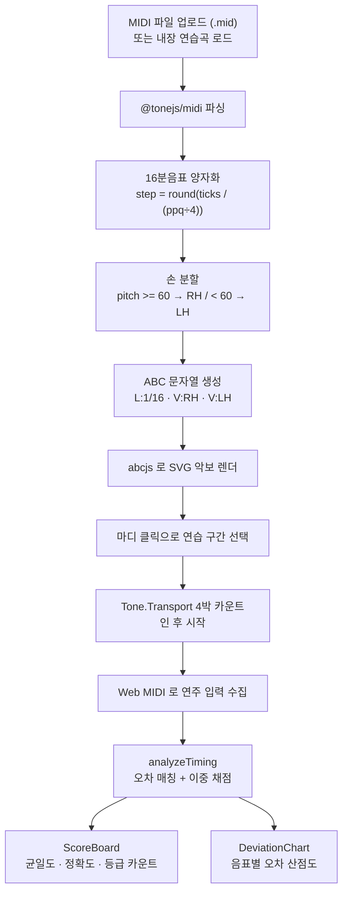
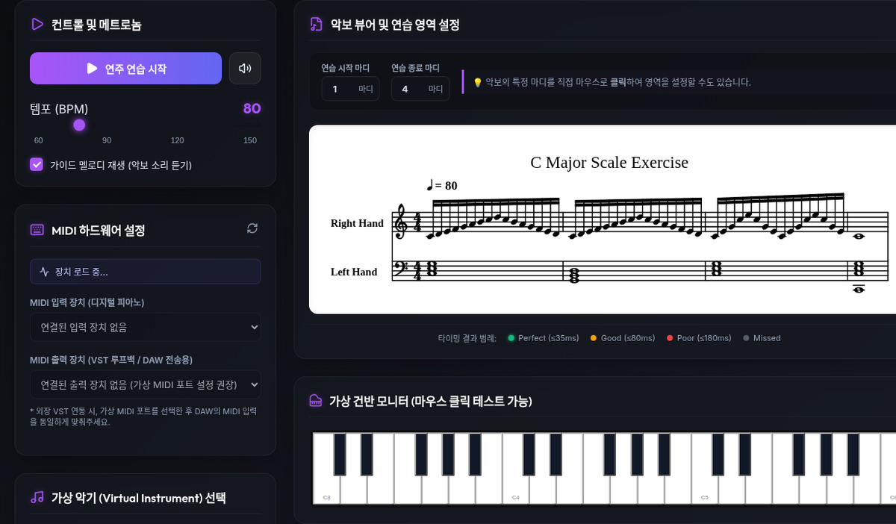
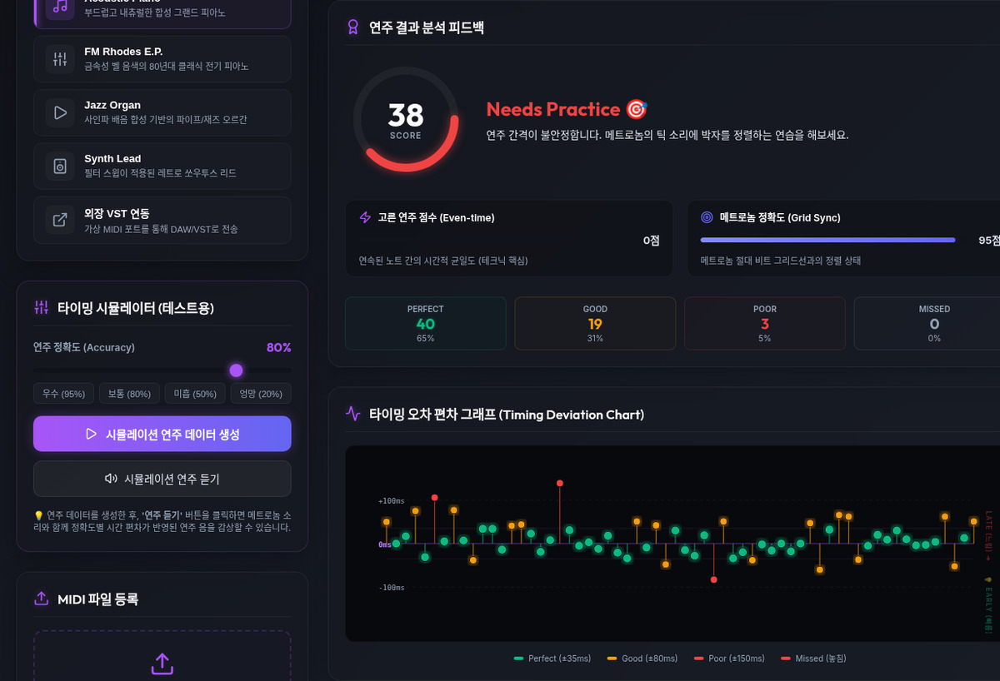
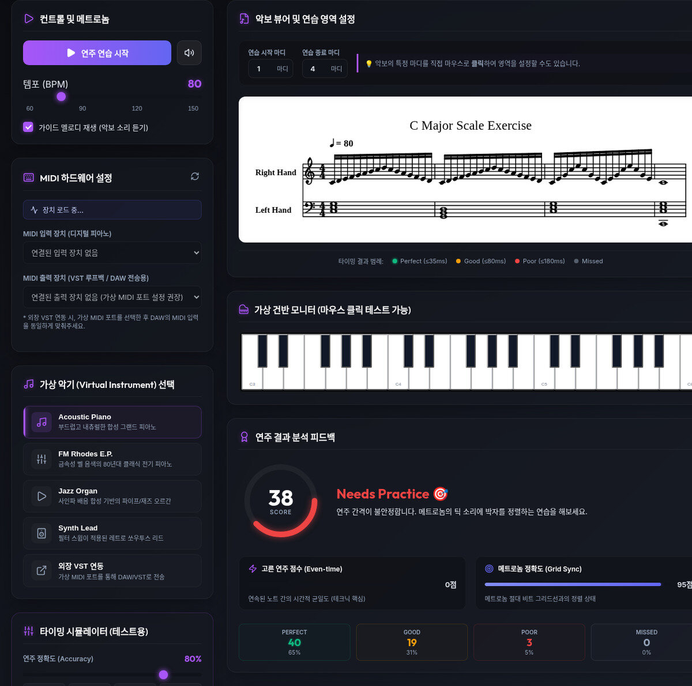

# Piano Tech Coach: 브라우저에서 실시간으로 피아노 타이밍을 채점하다

> 디렉터(Mike)가 단독 개발한 클라이언트 전용 피아노 테크닉 코치를,
> Aether Turing Dynamics(ATD)가 편입하여 전수 분석·문서화한 기술 케이스 스터디입니다.

---

## 1. 프로젝트 목적 및 배경 (Goal & Mission)

### 해결 과제: 연주가 고른지 아닌지 스스로 알기 어렵다

피아노 연습에서 "박자를 맞춘다"와 "음 사이 간격을 고르게 유지한다"는 서로 다른 능력입니다. 메트로놈에 정확히 맞춰 쳤더라도 음마다 간격이 들쭉날쭉하면 리듬은 흔들리고, 반대로 간격은 고른데 그리드에서 밀리면 전체가 처집니다. 사람은 자기 연주를 들으면서 이 두 가지를 동시에 판별하기 어렵습니다.

기존 방식은 두 갈래로 나뉩니다. 하나는 사람 선생님이 옆에서 지적해 주는 방식이고, 다른 하나는 DAW에 연주를 녹음해 파형을 눈으로 보는 방식입니다. 전자는 상시 사용할 수 없고, 후자는 "무엇이 문제인지"는 알려주지 않습니다.

### 프로젝트 핵심 목표

1. MIDI 파일 하나로 연습 구간을 지정하고 메트로놈과 함께 반복 연주한다.
2. 디지털 피아노의 MIDI 입력을 실시간으로 받아 예상 음표와 대조한다.
3. 절대 박자 정확도와 상대 간격 균일도를 분리해 채점하고, 어느 축이 약한지 즉시 보여준다.
4. 서버 없이 브라우저 안에서 파싱·연산·재생을 모두 완결하여, 악보와 연주 데이터를 외부로 보내지 않는다.



---

## 2. 개발 및 ATD 편입 경과

### 2-1. 디렉터 단독 개발

React 19 + TypeScript + Vite 기반의 클라이언트 전용 SPA로 구현되었습니다. 서버 프로세스와 데이터베이스가 없고, `src/` 아래 TypeScript/TSX 파일 전체가 브라우저에서 실행됩니다. 상태관리 라이브러리 없이 `useState` / `useRef` / `useCallback`만으로 전역 상태를 관리합니다.

저장소 커밋 이력은 2건이며 모두 2026-06-23입니다(최초 커밋 `d7cc130`, README 갱신 `68fe009`). 그 이전의 설계·반복 수정 과정은 커밋 이력에 남아 있지 않으므로, 개발 소요 기간은 이력만으로 산정하지 않았습니다.

### 2-2. ATD 허브 편입 (2026.09.23)

이 프로젝트는 ATD 편성 하에 개발된 것이 아니므로, ATD는 최초 기능 구현에 참여하지 않았습니다. 편입 시점의 코드베이스를 전수 분석하여 문서화하고, 이어 승인 범위에서 소스를 수정했습니다.

| 단계 | 담당 | 수행 내용 |
| :--- | :--- | :--- |
| 기준선 확정·전수 분석 | Atlas | `origin/main...HEAD` 0/0 대조, 코드베이스 구조·연산 로직·데이터 흐름 분석, 편입 파이프라인 편성 |
| 플랫폼 이관 검증 | Axel | `npm ci` 설치·빌드·lint 무결성, 외장 VST 라우팅 문서의 플랫폼 모순 확인, 오디오 스택 실동작 확인 |
| 소스 수정 (문구 OS 중립화) | Maya | 인앱 외장 VST 안내 문구의 Windows 전용 표현을 OS 중립으로 정정 (`InstrumentSelector.tsx`, `MidiConnector.tsx`) |
| 소스 수정 (시간축 격리) | Kai | Web MIDI 전송 타임스탬프와 Tone/AudioContext 시간축을 분리하는 헬퍼 신설 (`audioSynth.ts`) |
| 포트폴리오 에셋 제작 | Sora | 대표 썸네일 및 UI 개요 이미지 4건 (`docs/assets/`) |
| 감사 | Elena | 편입 슬라이스 무관용 감사, 판정 **NEEDS_IMPROVEMENT**. N1 재현 검증, 서술-구현 불일치 전수 조사, A11y 정적 전수조사, PII/제3자 저작물 검사 |
| 검증 | Noah | 산출물 전수 대조, TOML 파싱·하드 게이트 통과, 4,162행 재측정, 소스 변경 등가성 판정, 빌드·lint 재현, 최소 검증집합 설계 |
| 소스 수정 (감사 지적 2건, 완료·검증) | Maya | 편차 차트 범례 ±180ms 정정(DeviationChart.tsx), A11y 폼 라벨 6건 연결(Metronome.tsx, SheetMusicViewer.tsx, SimulatorPanel.tsx 외) — Noah 재검증 PASS |

아키텍처 명세 작성(Leo)은 아직 수행하지 않았습니다. 감사 판정은 **NEEDS_IMPROVEMENT**이며(남은 결함이 활성이므로 유지), 소스 결함 2건은 승인 하에 수정·재검증 완료(Noah PASS)했습니다. Kai가 수행한 시간축 격리는 별개 개선이며, 메트로놈 정지→재시작 시의 Transport 틱 역행 에러는 해소하지 못했습니다(`PROJECT-DESCRIPTION.md` §4.4 N3). 허브 등재는 후속 작업으로 남아 있습니다.

---

## 3. 시스템 아키텍처 및 핵심 기술

### 3-1. 백엔드가 없는 3계층

이 프로젝트에는 백엔드가 없습니다. HTTP API, 데이터베이스, 서버 워커가 모두 존재하지 않으며, 3계층이 모두 브라우저 안에서 나뉩니다.

| 계층 | 위치 | 책임 |
| :--- | :--- | :--- |
| 표현 | `src/App.tsx`, `src/components/*.tsx` | 화면 렌더, 사용자 입력, 상태 보관 |
| 도메인 로직 | `src/utils/midiParser.ts`, `timeAnalyzer.ts`, `exerciseGenerator.ts` | MIDI 파싱·양자화, 채점 연산, 연습곡 생성 |
| 오디오·장치 | `src/utils/audioSynth.ts`, `src/components/MidiConnector.tsx` | 신디사이저 재생, Web MIDI 입출력 |

단방향 흐름은 `App.tsx`가 모든 상태를 소유하고 하위 컴포넌트가 props로 값과 setter를 받는 구조로 유지됩니다. 표현 컴포넌트는 7개로 분리되어 있습니다.

### 3-2. MIDI → ABC 변환과 악보 렌더링 (`midiParser.ts`)

MIDI 파일을 그대로 그리지 않고 ABC 표기법으로 변환해 abcjs로 렌더링합니다. 변환 과정에 도메인 규칙이 응축되어 있습니다.

- 16분음표 양자화: 1스텝을 `round(ppq / 4)` 틱으로 정의하고, 음표 시작 틱을 이 값으로 나눠 반올림합니다(`midiParser.ts:63`, `:84`). 연주자가 아니라 악보를 기준으로 삼기 때문에 연주 타이밍의 흔들림과 무관하게 안정적인 그리드가 나옵니다.
- 손 분할: 음높이 60(C4)을 경계로 오른손(treble)과 왼손(bass)을 나눠 서로 다른 보이스로 그립니다(`midiParser.ts:106-107`). 두 손을 한 보이스에 섞으면 음역이 뒤엉켜 읽기 어려워지는 문제를 코드 상수 하나로 정리한 것입니다.
- 마디 계산: `stepsPerMeasure = 박자표분자 × (16 / 박자표분모)`로 박자표에서 파생합니다(`midiParser.ts:86`). 4/4에서는 16스텝입니다.
- 출력 ABC는 단위 음표 길이 `L:1/16`, 조표 `K:C` 고정에 두 보이스(`V:RH clef=treble`, `V:LH clef=bass`)를 병기합니다(`midiParser.ts:186-196`).



### 3-3. 이중 채점: 그리드 정확도와 균일도의 분리 (`timeAnalyzer.ts`)

이 프로젝트의 핵심입니다. 두 지표를 각각 다른 방식으로 계산하고, 마지막에 가중 합산합니다.

#### 3-3-1. 오차 매칭과 등급 경계

예상 음표를 시간순으로 돌면서 같은 음높이의 아직 소비되지 않은 연주 노트 중 가장 가까운 하나를 고릅니다. 매칭 허용 창은 180ms이며, 이를 넘으면 매칭되지 않고 미연주로 처리됩니다(`timeAnalyzer.ts:99`, `:133`).

등급 경계는 고정 상수입니다(`timeAnalyzer.ts:32-34`).

| 등급 | 절대 오차 |
| :--- | :--- |
| perfect | 35ms 이하 |
| good | 80ms 이하 |
| poor | 180ms 이하 |
| missed | 180ms 초과 또는 미연주 |

#### 3-3-2. 그리드 정확도 (accuracy)

오차 크기에 대해 조각별 선형 점수를 부여합니다. 35ms 이하 100점, 180ms 이상 20점, 그 사이는 35~180ms 구간에서 100→20으로 선형 감쇠하며 하한은 20점입니다. 미연주는 0점입니다(`timeAnalyzer.ts:155-166`). 절대 오차를 보는 축입니다.

#### 3-3-3. 균일도 (evenness)

인접한 연주 음 사이 간격을 예상 간격으로 나눈 비율의 표준편차 σ를 씁니다. 화음처럼 두 예상 음이 같은 틱에서 시작하는 경우는 분모가 0이 되므로 제외합니다(`timeAnalyzer.ts:185`).

```
Evenness Score = max(0, 100 × (1 - 4σ))
```

σ = 0.25, 즉 평균 25%의 간격 오차에서 0점이 됩니다(`timeAnalyzer.ts:202`). 절대 위치가 아니라 간격의 일정함을 보는 축이므로, 전체가 일정하게 밀린 연주에는 관대하고 음마다 튀는 연주에 엄격합니다.

#### 3-3-4. 최종 점수 가중치

최종 점수는 균일도 60%, 그리드 정확도 40%입니다(`timeAnalyzer.ts:213-215`). 이 프로젝트의 목표가 "고르게 치기"이므로 균일도에 더 큰 비중을 둔 것입니다.



### 3-4. 실시간 채점과 최종 채점의 단일화

실시간 증분 채점과 세션 종료 후 최종 채점은 같은 `analyzeTiming` 함수를 씁니다. 실시간 경로는 경과 시간(`elapsedTime`)을 넘겨 아직 도래하지 않은 음표를 건너뛰고(`timeAnalyzer.ts:86-88`), 최종 경로는 이를 생략해 전체 구간을 확정 채점합니다. 매 박마다 실시간 채점이 실행되어 연주 중에도 점수가 갱신됩니다(`App.tsx:84-98`, `:189`).

입력 출처는 구분하지 않습니다. 실시간 MIDI 입력도, 시뮬레이터가 만든 합성 데이터도 같은 `PlayedNote` 형태로 정규화되어 같은 채점 함수로 들어갑니다(`timeAnalyzer.ts:3-8`, `App.tsx:114-118`, `:350-355`). 내장 연습곡도 파일 업로드와 동일한 파서를 통과합니다(`exerciseGenerator.ts:123-127`).

### 3-5. 오디오 엔진과 외부 VST 라우팅

메트로놈과 가이드 재생은 Tone.js Transport 스케줄러로 구동합니다. 1마디(4박) 카운트인 뒤 테스트가 시작되고, 시작 시각을 `performance.now()`로 고정해 채점의 시간 원점으로 씁니다(`App.tsx:166` 카운트인 시작, `:186` 시간 원점 고정). 내장 가상악기는 어쿠스틱 피아노, 로즈 피아노, 재즈 오르간, 신스 리드 4종입니다(`audioSynth.ts:3`).

브라우저는 VST 바이너리를 직접 로드할 수 없으므로, Web MIDI 출력을 loopMIDI 같은 가상 포트로 내보내 DAW의 가상악기로 라우팅하는 방식을 지원합니다(`README.md:91-135`). 채점은 웹에서, 소리는 데스크톱 가상악기에서 내는 구성입니다.

### 3-6. 휴먼 타이밍 시뮬레이터

정확도 슬라이더(0~100%)를 받아 Box-Muller 변환으로 가우시안 타이밍 오차를 주입합니다. 정확도 95% 이상은 오차 0(심리음향적으로 완벽한 기계 연주)으로 취급하고, 그 미만은 σ를 0.002초에서 0.25초로 스케일합니다. 미연주 확률은 0% 정확도에서 최대 20%입니다(`App.tsx:326-332`, `:340-344`). 생성된 데이터는 채점 함수로 흘려보낼 수도 있고, 스피커 아이콘으로 직접 청취할 수도 있습니다.



---

## 4. ATD 편입 소견 (2026.09.23 시점)

이 절은 편입 시점에 확인한 사실에 더해, 같은 날 수행한 감사(Elena)·검증(Noah)의 결과를 함께 기록합니다. 감사 판정은 **NEEDS_IMPROVEMENT**이며, 상세는 `PROJECT-DESCRIPTION.md` §4.5에 있습니다.

### 4-1. 확인된 사실

- 기준선: `origin/main...HEAD` = `0 0`으로 로컬과 원격이 일치함을 확인했습니다.
- 자동 테스트가 0건입니다. 테스트 프레임워크(vitest·jest 등)도 테스트 파일(`*.test.*`, `*.spec.*`)도 존재하지 않습니다. 회귀를 감지할 자동 장치가 없습니다.
- 코드 규모는 `src/` 기준 TypeScript/TSX 2,718행 + CSS 1,444행 = 4,162행입니다.
- ATD 코드 품질 물리 제약(파일 300줄) 기준으로 초과 파일이 존재합니다. `src/App.css`가 1,350행, `src/App.tsx`가 636행입니다. 참고로 허브의 `check-code-quality.sh`는 현재 `.py/.sh/.ps1/.bicep`만 검사 대상으로 삼아 `.ts/.tsx/.css`는 자동 검출되지 않습니다.

### 4-2. 소스 수정 (승인 후 수행)

소스코드 수정은 거버넌스(Mike)의 명시적 승인이 필요한 사안이며, 편입 후 승인 범위에서 수행했습니다. 범위는 인앱 외장 VST 문구의 OS 중립화와 Web MIDI/오디오 시간축 격리로 시작해, 감사 지적 소스 결함 2건(편차 차트 범례, A11y 폼 라벨) 수정으로 이어집니다. 신규 기능 구현은 포함하지 않습니다. 이로써 개발 출처는 `mike+atd`가 되었고, 편입 배지(`ATD Adopted Project`)를 동반합니다.

감사(Elena)는 **NEEDS_IMPROVEMENT**로 판정했고, 검증(Noah)은 산출물 전수 대조·TOML 파싱·하드 게이트 통과·4,162행 재측정을 확인했습니다. 감사가 지적한 소스 결함 2건은 수정 후 Noah 재검증 PASS로 확인됐습니다(개별 항목 한정). 다만 감사 verdict는 슬라이스 전체에 대한 것이고 N1 등 나머지 결함이 활성이므로 **NEEDS_IMPROVEMENT는 유지합니다** — verdict를 PASS로 바꾸는 것이 아닙니다. 승인 범위 밖의 결함과 감사·검증이 적발한 나머지 항목은 삭제하지 않고 `PROJECT-DESCRIPTION.md` §4.4 백로그로 이관하는 원칙을 따릅니다.

---

## 5. 결론 및 향후 확장

Piano Tech Coach는 "내 연주가 고른가"라는 개인적 질문을 브라우저 하나로 답하는 도구입니다. 서버가 없다는 점이 이 프로젝트의 성격을 규정합니다. 악보 데이터와 연주 데이터가 기기 밖으로 나가지 않고, 설치 없이 열면 바로 동작합니다.

기술적으로 눈에 띄는 지점은 채점 모델의 분리입니다. 절대 박자 정확도와 상대 간격 균일도를 따로 계산하고, 최종 점수에서 균일도에 60%를 배분했습니다(`timeAnalyzer.ts:213-215`). "박자를 맞추는 것"과 "고르게 치는 것"은 다르다는 도메인 판단이 가중치 한 줄에 드러나 있습니다. 등급 경계 35/80/180ms와 균일도 공식의 σ 계수 4도 모두 코드 상수로 고정되어 있어, 판정 기준이 실행할 때마다 흔들리지 않습니다.

동시에 인수인계 관점에서는 보완할 지점이 있습니다. 자동 테스트가 0건이라 이 연산들이 회귀 없이 유지된다는 보장이 없고, `App.tsx` 636행과 `App.css` 1,350행은 기능 추가보다 유지보수를 먼저 막는 구조입니다. 편입 감사는 이 지점들 때문에 **NEEDS_IMPROVEMENT**로 판정됐습니다. 문서 결함은 정정됐고 소스 결함 2건은 수정·재검증 완료(Noah PASS)했으며, 나머지는 백로그로 이관했습니다. 남은 결함 상환이 끝나면, 채점 파라미터를 근거와 함께 문서화한 상태로 다음 사람이 이어받을 수 있게 됩니다.

대표 썸네일과 UI 개요 이미지 등 포트폴리오 에셋은 `docs/assets/`에 제작되었습니다.
